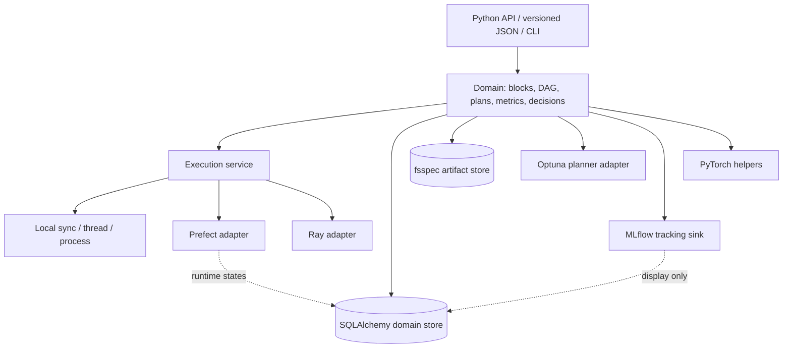
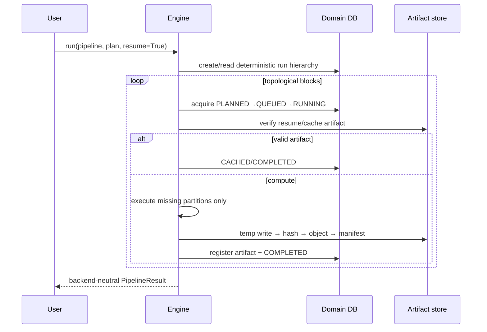
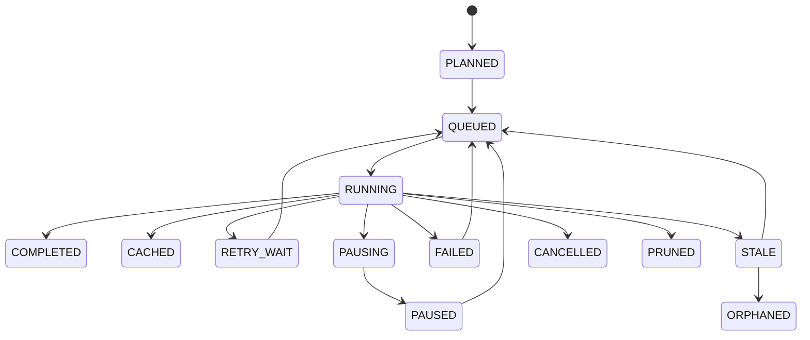
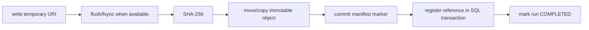
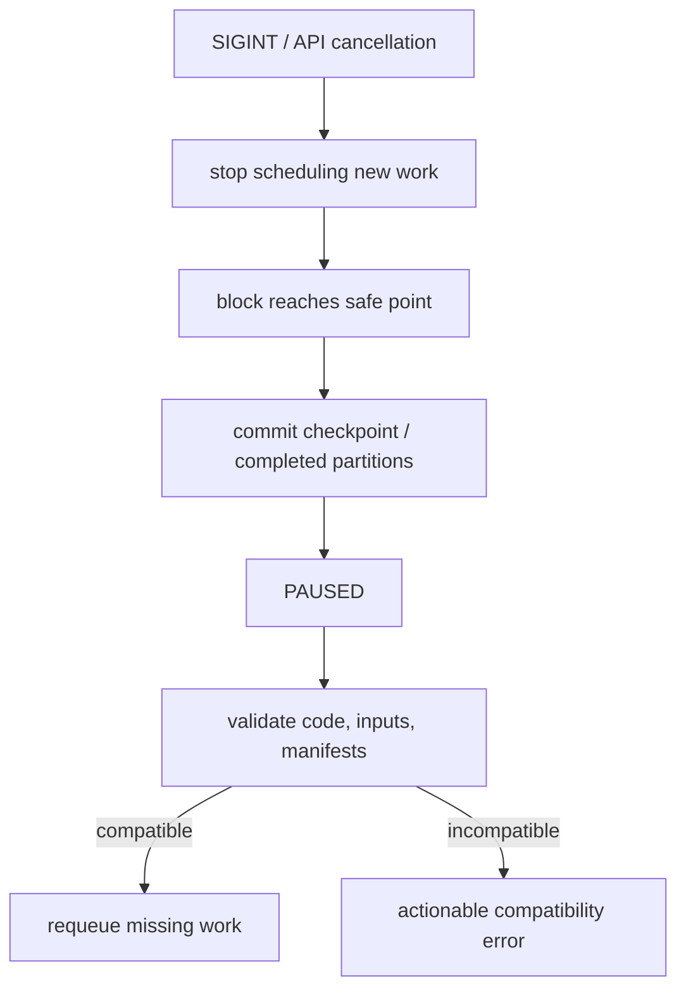
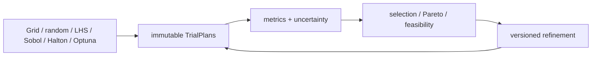

# Runweaver architecture

Runweaver is a domain layer for typed computational pipelines and iterative
experiments. It composes mature execution, optimization and tracking systems;
it does not replace their numerical or operational capabilities.

The dependency rule is strict: core modules do not import a user application,
PyTorch, Ray, Optuna or MLflow. Optional adapters import domain contracts.
Backend-native state and handles are translated before reaching the public API.

## Domain boundaries

- A `Block` owns typed computation and declares determinism, idempotency,
  resources, retry/cache/checkpoint policy and side effects.
- A `Pipeline` owns a validated DAG, node-local parallelism and fan-in/out.
- A `TrialPlan` is immutable after a planner materializes it.
- Metrics describe observations. `DecisionPolicy` selects. A
  `RefinementStrategy` returns a new parameter-space version.
- The SQL store is authoritative for experiment, trial, pipeline, block and
  partition state. Prefect and MLflow are projections.
- The artifact store owns large payloads, content hashes, commit manifests and
  lineage; SQL stores references and searchable metadata.

## Execution sequence

## State machine

All transitions are centralized and persisted with an optimistic version
column. Running workers can hold expiring leases and emit heartbeats.
Reconciliation marks expired work `STALE`; recovery policy decides whether it
is safe to requeue.

## Artifact commit

The cache key contains semantic block/version, code fingerprint, resolved
parameters, upstream hashes, model hash when present, serializer/environment
versions, seed and declared external dependencies. Runtime IDs are excluded.

## Pause and resume

## Global-to-local experiment loop

