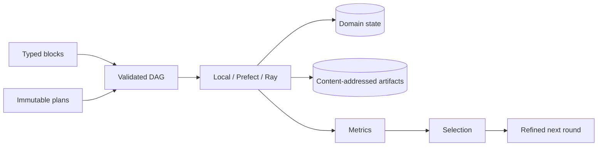

# What is it?

This library is built entirely with Codex ai-agent based on the feature and object structure of my ML pipelines that I've used in analysis of astrophysical images with computer vision (CV) algorithms. 

Please use it with caution. However, it has been useful for scaling some features like:
- experiment planning;
- storage of intermediate calculations and allowing it to resume;
- pipeline building from blocks;
- automatic formation of experiment schedules with latin hypercubes of hyperparameters of ML-algorithms;
- configuration of custom data types as i/o between blocks
- synthetic datasets generation and usage
- CV algorithm evals for big batches of experiments

It is useful, when you have a big algorithmic pipeline that is run on a local machine from tine to time and you need to tune a lot of hyperparameters and work flexibly with it.

# Runweaver

Runweaver is a typed domain layer for building, planning, executing and safely
resuming computational and ML experiments over mature execution and tracking
backends.

It addresses the gap between a function/task orchestrator and an experiment
script: explicit Pydantic I/O, immutable trial plans, per-stage resources,
partition-level recovery, content-addressed lineage, DOE/adaptive planning,
selection and versioned local refinement.

## Capabilities

- linear pipelines and validated DAGs;
- typed function/class blocks with declared side effects;
- node-local map parallelism with sync, thread and process execution;
- CPU/GPU/RAM/custom resource declarations;
- ephemeral and durable materialization without changing block APIs;
- SQLAlchemy state hierarchy, optimistic locking, leases and reconciliation;
- fsspec artifact stores with SHA-256 manifests and deterministic cache keys;
- safe partition resume and checkpoint services;
- grid, random, factorial, Latin hypercube, Sobol and Halton designs;
- optional Optuna, Prefect, Ray, MLflow and PyTorch adapters;
- single/multi-objective decisions, feasibility and Pareto selection;
- elite zoom, neighborhood, trust-region, replication and robustness strategies.

## Minimal example

```python
from pydantic import BaseModel
from runweaver import LocalExecutor, Pipeline, function_block

class Values(BaseModel):
    values: list[float]

def normalize(inputs: Values, context) -> Values:
    total = sum(inputs.values) or 1.0
    return Values(values=[value / total for value in inputs.values])

pipeline = Pipeline("demo").then(
    function_block(normalize, inputs=Values, outputs=Values)
)
result = LocalExecutor().run(pipeline, Values(values=[1, 2, 3]))
print(result.final_output)
```



## Installation

```bash
python -m venv .venv
.venv/bin/pip install -e .
```

Optional capabilities are explicit:

```bash
.venv/bin/pip install -e '.[optuna,pytorch,ray,mlflow,s3]'
.venv/bin/pip install -e '.[dev,docs]'
```

No service is required for the local quickstart. Production deployments can
combine PostgreSQL, S3-compatible storage, Prefect and Ray.

## Declarative run

```bash
runweaver validate examples/experiment.json
runweaver plan examples/experiment.json --output /tmp/plan.json
runweaver run examples/experiment.json
```

The schema is available with `runweaver schema`.

## Tutorials

The twelve paired `.py`/`.ipynb` tutorials cover the full progression from a
small sequential regression pipeline to Prefect/Ray/MLflow and prototype
migration. Tutorial 12 is the executable `article_v1`/`article_v2` image
processing example:

```bash
.venv/bin/python tutorials/12_migrating_article_workflows.py --protocol both
```

See [tutorials/EXPECTED_RESULTS.md](tutorials/EXPECTED_RESULTS.md) and the
[documentation](docs/index.md).

## Maturity and non-goals

Version `0.1` is an alpha API: the domain contracts and local durable engine
are usable, while production backend breadth and performance tuning continue.
Runweaver does not replace PyTorch, Lightning, Prefect, Ray, Optuna or MLflow.
It connects generation, processing, evaluation, planning, recovery and
iterative refinement above those components.

It is not a data warehouse, feature store, model-serving system or universal
training framework. Stream execution is rejected until an application supplies
backpressure and checkpoint semantics.

## Development

```bash
.venv/bin/ruff check .
.venv/bin/mypy
.venv/bin/pytest
.venv/bin/mkdocs build --strict
.venv/bin/python -m build
```

Architecture decisions are under `docs/architecture/decisions`. The migration
audit and compatibility limits are under `migration`.
