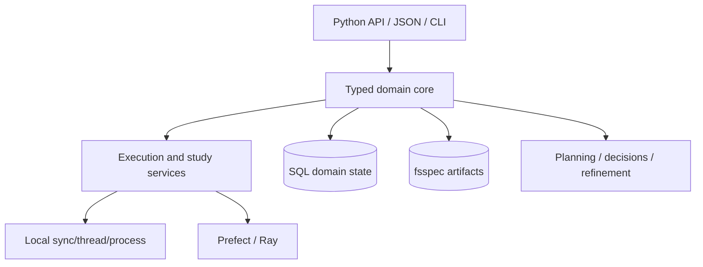

# Architecture

Runweaver uses a backend-independent domain core, application services for
planning/execution/recovery, SQLAlchemy and fsspec infrastructure, and optional
Prefect/Ray/Optuna/MLflow/PyTorch adapters.

The package dependency direction always points inward. Optional backend types
never appear in root exports. The SQL store owns domain lifecycle and the
artifact store owns large immutable payloads; orchestration/tracking backends
are projections.

The root `ARCHITECTURE.md` contains expanded state, sequence, artifact commit,
pause/resume and experiment-loop diagrams. The ADRs in this section record the
ten foundational decisions.
